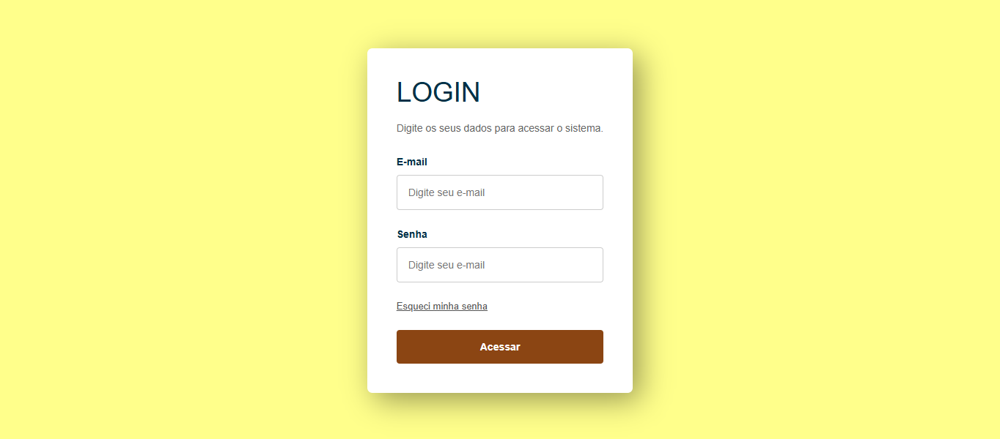
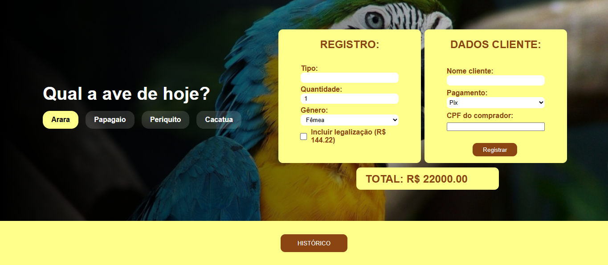
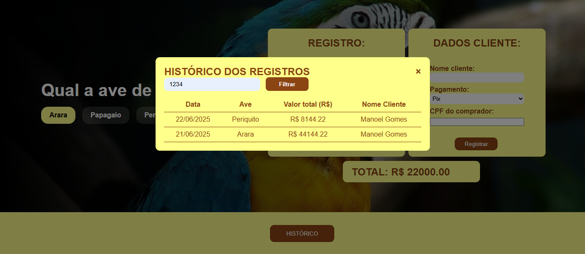
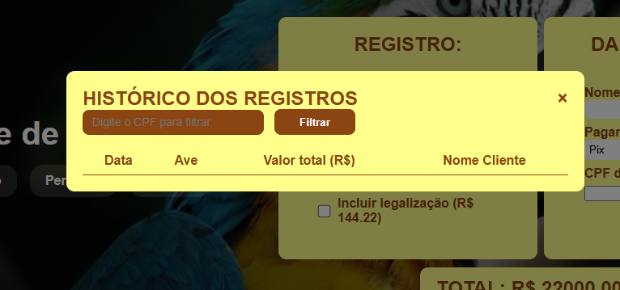
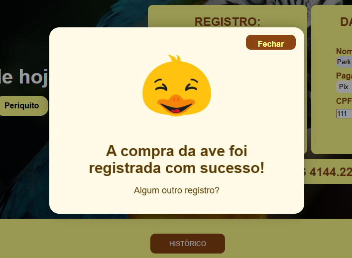

# Sistema ADmin para Registrar Aves
O objetivo do projeto é registrar a saída (compra) de uma ave. Inicialmente tem uma página de login (aqui os dados de acesso já devem estar cadastrados no banco) e ao logar, te redireciona para a página principal do sistema, a dos registros. Você pode escolher 1 entre 4 opções e informar os dados da ave e os dados de compra do cliente. Ao apertar em "Registrar" os dados são salvos automaticamente no back-end.

Também há a opção de "Histórico" (armazena todos os registros já salvos) que ao ser clicada, terá uma barra para informar o CPF e filtrar todas as compras deste.

## Design do projeto 
### Página do Login

### Página Principal

### Modal do Histórico

## Biblioteca utilizada

Também foi utilizada a biblioteca SweetAlert2 [https://sweetalert2.github.io/] para a geração dos modais abaixo:



```

## Funcionalidades
- [ x ] Filtrar histórico pelo cpf
- [ x ] Registrar dados da ave + cliente
- [ x ] Exibe valor total da compra
- [ x ] Envio automático ao banco de dados
- [   ] Responsividade 
- [   ] Permitir múltiplas escolhas do gênero
- [   ] Opção "Cartão" ter mais dados
- [   ] Histórico exibir todos os registros

### Observações: 

 > [!NOTE]
 > Projeto feito na disciplina de Programação WEB I do curso de ADS do IFCE de Jaguaruana.

 > [!IMPORTANT]
 > Não indicado para dispositivos mobile ou achatamento de tela no desktop.

## Contatos
Email: laisccastroc2023@gmail.com
